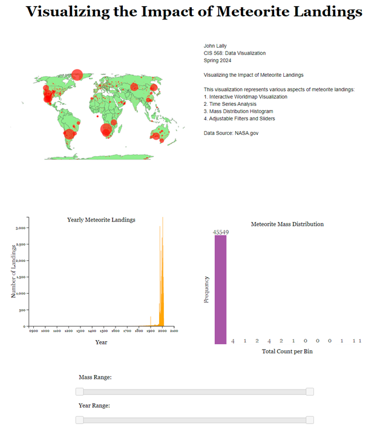
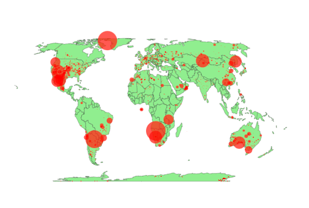
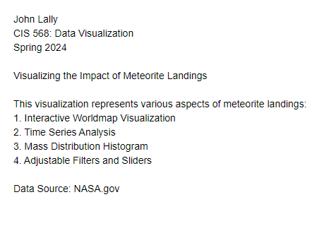
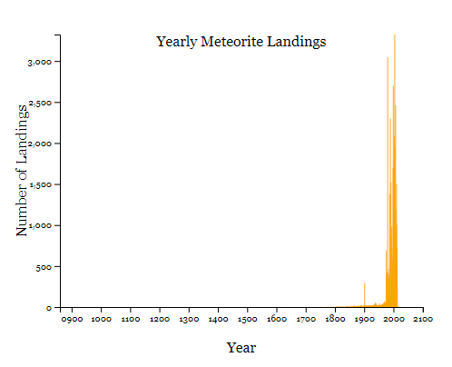
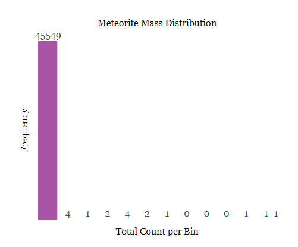

<h1>Visualizing the Impact of Meteorite Landings Over Time and by Type on Earth’s Surface</h1>
<h3>John Lally</h3>
<h3>CIS 568: Data Visualization</h3>
<h3>Spring 2024</h3>
<h2>Description:</h2>
<ol>

<li>Interactive Webpage Overview 
</li>

<li>Interactive World Map 
 </li>

<li>Description 
 </li>

<li>Time Series Analysis 
 </li>

<li>Mass Histogram 
 </li>

<li>Filters/Sliders 
 </li>